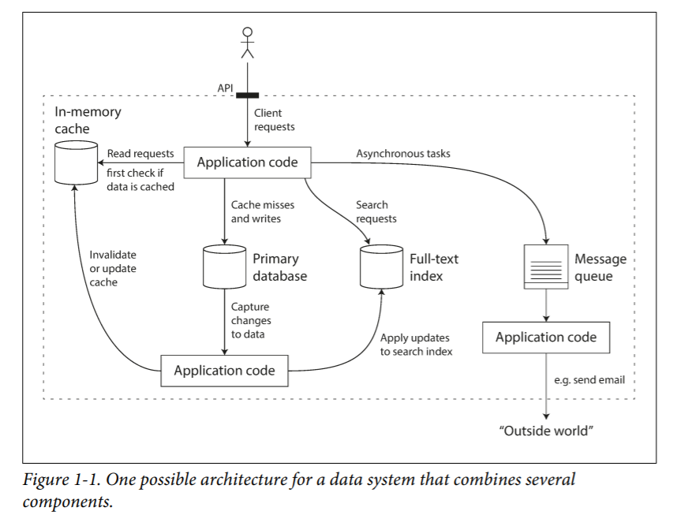
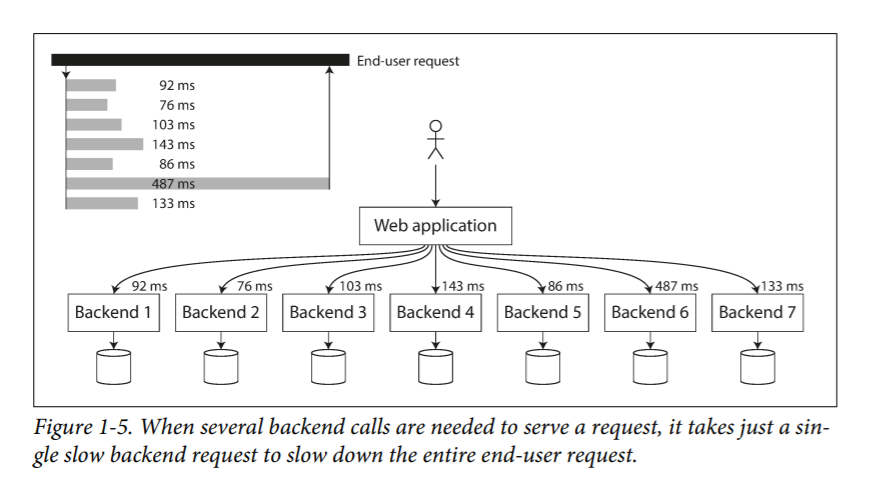

<!-----
NEW: Check the "Suppress top comment" option to remove this info from the output.

Conversion time: 1.073 seconds.

Using this Markdown file:

1. Paste this output into your source file.
2. See the notes and action items below regarding this conversion run.
3. Check the rendered output (headings, lists, code blocks, tables) for proper
   formatting and use a linkchecker before you publish this page.

Conversion notes:

* Docs to Markdown version 1.0β29
* Fri May 28 2021 07:23:06 GMT-0700 (PDT)
* Source doc: DDIA
* This document has images: check for >>>>>  gd2md-html alert:  inline image link in generated source and store images to your server. NOTE: Images in exported zip file from Google Docs may not appear in  the same order as they do in your doc. Please check the images!

----->

Chapter 1

Reliable, Scalable, and Maintainable Applications

*   Requirements of a data intensive application-
    *   Databases - Store and retrieve data Eg - Oracle,MySql
    *   Caches - Remembers result of expensive operation and speeds up read.Eg - Memcache
    *   Search Indexes - Allow users to search/filter data in various ways.Eg - Lucene
    *   Message Queues - For passing messages between processes.Eg - Apache Kafka
    *   Stream Processing - Sends message to other process,handled asynchronously.Eg Apache Spark/Samza
    *   Batch Processing - Periodically crunch large amount of accumulated data.Eg Hadoop
*   Typical data intensive applications involves combination of several components with application code sticking it together- 

    *   The application code is responsible to write the data to the database and sync the search index(elasticsearch) and cache with the new changes.The application code is also responsible to perform/initiate asynchronous tasks using a queue(kafka) like sending an email.
*   Three concerns of data intensive system - 
    *   Reliability - System should not fail(both function and performance) despite adversities like software errors,hardware faults and human error.
        *   Hardware Faults - Mitigated by adding redundancy to individual components.
        *   Software errors and Human errors - Leads to systemic error.A insidious bug may effect every node and thus is more damaging.Prevented by good design,staging before deploying,Unit tests,Easy rollback etc.
    *   Scalability - System should be able to cope up with reasonably increased load.
        *   Describing Load - May be response time to web server hit,ratio of reads and writes to db,number of simultaneously active users in chat room,hit rate on a cache etc.Eg - Twitter has two main tasks - 
            *   Post Tweet - User can publish tweet to their followers(4.6k request/sec on avg and 12k requests/sec peak load.)
            *   Home Timeline - User can retrieve it's timeline to view tweets(300k requests/sec)
            *   Twitter has two ways to deliver features - 
                *   Maintain a global dictionary of tweets and update it as soon as it is posted.Whenever a user queries timeline,retrieve list tweets by their followers and display it.Here all the heavy lifting is done at the time when timeline is retrieved(or the read time).
                *   Maintain a cache of each user’s timeline.As soon as a tweet is posted,add it to the followers timeline cache.This approach makes timeline retrievals cheap as most work is done at post time(or write time).
            *   The second approach was the newly adopted approach as requests for home timeline are couple of orders more than post request.So more work is preferably done at post time.
            *   The second approach requires a tweet to be delivered to 75 followers on an average thus 4.6*75 = 345k writes to cached home timelines/sec.But problem arises when celebrities tweet.They may have up to 30m followers.Twitter uses a hybrid approach.Most of the user’s(with less followers) tweets when posted follow the second method and when celebs tweet,it follows the first method.
        *   Describing Performance - For a web server,usually response time is the desired load parameter and the performance matrix used is percentile of response time.Median of performance times is the 50th percentile meaning 50% of users face less than this time.Similarly p90,p95,p99 are 90th,95th and 99th percentiles resp.
            *   Latency vs response time - Response time is total time a client faces to get a response from the web service.It includes network delays,service time,queueing delays etc.Latency is amount of time the request is waiting to be processed/handled.

        *   Strategies for coping up with load - 
            *   Scaling up - moving to a more powerful machine
            *   Scaling out - distributing load to multiple smaller machines
            *   In reality, good architectures usually involve a pragmatic mixture of approaches: for example, using several fairly powerful machines can still be simpler and cheaper than a large number of small virtual machines.
            *   Distributing stateless services is straightforward but distributing a stateful node like databases introduces lots of complexity.
    *   Maintainability - Operability,Simplicity and evolvability.