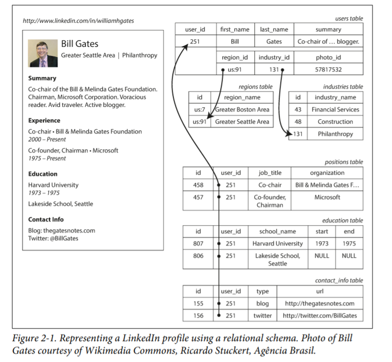
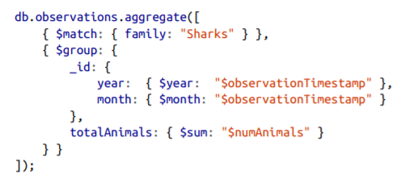

<!-----
NEW: Check the "Suppress top comment" option to remove this info from the output.

Conversion time: 3.455 seconds.

Using this Markdown file:

1. Paste this output into your source file.
2. See the notes and action items below regarding this conversion run.
3. Check the rendered output (headings, lists, code blocks, tables) for proper
   formatting and use a linkchecker before you publish this page.

Conversion notes:

* Docs to Markdown version 1.0β29
* Mon May 31 2021 11:44:49 GMT-0700 (PDT)
* Source doc: DDIA
* This document has images: check for >>>>>  gd2md-html alert:  inline image link in generated source and store images to your server. NOTE: Images in exported zip file from Google Docs may not appear in  the same order as they do in your doc. Please check the images!

----->

# Chapter 2

### Data Models and Query Languages

*   Layers of data model - 
    *   Application developer models the real world in terms of objects or data structures and manipulates them by building APIs.
    *   For storing these data structures,the developer expresses them in data models like JSON/XML documents,tables in relational database or graph model.
    *   Engineers building database express the JSON/XML/relational/graph data in terms of bytes in memory,disk or on network which can further be queried,searched and manipulated.
    *   On the lowest levels,hardware engineers have found a way to represent bytes in terms of electrical current,pulses of lights,magnetic fields etc.
*   Relational model vs Document model
    *   In relational model,data is organized into relations(known as tables in SQL) where each relation is unordered collection of tuples(rows in SQL).
    *   Forces behind birth of NoSQL-
        *   Need for greater scalability and very high write throughput(Complicated transactions(ACID) etc. leads to complexity in scalability across various machines and also leads to limited throughput,NoSQL sacrifices this functionality and thus have greater scalability and high write throughputs.) 
        *   Free and opensource vs commercial
        *   Specialized query operations that are not well supported by the relational model(needs explaination)
        *   More dynamic data model as compared to restrictive schema of Sql.
    *   The Object-Relational Mismatch
        *   Most programming is done today in Object Oriented languages.If data is stored in relational tables,it requires an awkward translation layer between objects in code and the database model of rows,tables and columns.This disconnect is known as impedance mismatch.
        *   For a linkedin styled app,the profile can be identified by unique identifier user_id.Fields like first_name,last_name appear once for a user so can be marked as columns.User may have more than one job in their career and may have been to multiple educational institutes.
        *   In SQL the most common way to store one to many relationships is to put positions,education etc in separate tables with forigen key reference to users table.For fetching a profile in this model we need to either perform multiple queries or perform a messy multi way join query.

        *   On the other hand,for JSON model in noSql databases one to many relation is very naturally represented as shown.

    *   Many To Many and Many to One Relationship
        *   We use ids to show properties like region and industry(region_id and industry_id) instead of text string “Greater Seattle Area” or “Philanthropy”.
        *   It brings many advantages like consistent spelling,avoiding ambiguity,Easy updation,Localization support and better search etc.This system of using ids thus preventing duplication of text strings is known as normalization.
        *   Normalization involves many to one relationships and is often achieved in relational systems by creating a different table each of region and industry and associating it with users table using a forigen key.The data is the queried using joins.In document model this is not possible as there is no support for joins and they have to be emulated in application code.
        *   In case of many to many relationships,say if organizations are to be represented as references(another table in relational db) because each organization has their own logo,picture,news feed etc. and as a part of normalization to avoid duplication they have to be represented in another table.A user can go to multiple organization and an organization can be linked with multiple users gives rise to many to many relation.This case is very difficult to be expressed in document model as joins will be used to query.

    *   Prefer document model when data in the application has document like structure(i.e. Tree of one to many relationships where typically entire tree is loaded at once).Choose relational model when application uses many to many relationships as joins will be used for querying.Needs of joins can be reduced by denormalizing data and keeping duplicates around but it complicates application code.Joins can also be handled by application code but will be slower.
    *   Document databases are typically  said to be schemaless but some sort of schema must be enforced at read time by application code.Thus document databases are “schema on read” while relational databases are “schema on write”.Schema on read is advantageous when either there are different types of objects to be stored or when structure of object is determined by external systems with no control at our end.
    *   Document databases have advantage of storage locality i.e. if the application needs to access the entire document,it can do easily so as the data is not split across multiple tables.This advantage only applies if the application needs large parts of document at the same time otherwise reading and updating large documents is inefficient.
*   Query Languages for Data
    *   IMS and CODASYL were imperative query languages while SQL like CSS is a declarative query language.
    *   Advantages of declarative query language is that it makes it possible for database systems to introduce performance improvements without requiring change in queries.Also a declarative language is more easily parallelizable as compared to imperative code.
    *   MapReduce Querying
        *   Processing large amount of data in bulk across many machines.
        *   Supported by some NoSql databases.
        *   MapReduce is combination of declarative and imperative query.The logic is expressed with snippets of code which are called repeatedly by the framework.Eg-

        *   The map and reduce functions should be pure functions i.e. should not make any db queries,use data only passed to them and cannot have any side effect.
        *   As MapReduce involves some sort of imperative code,MongoDB has come up with aggregation pipeline that lets users eliminate this for common applications.Aggregation for above will look like - 

    *   Graph-Like Data Models - 
        *   As data becomes more and more connected and there are a lot of many to many relationships,modelling data as a graph becomes natural.
        *   Graph consists of two kinds of objects: Vertices(nodes/entities) and edges(relationships/arcs).

        *   Property Graphs - Implemented by Neo4j,Titan and InfiniteGraph
            *   In this model vertex consists of a unique identifier,set of outgoing edges,set of incoming edges,collection of properties(key-value pairs)
            *   Edge consists of a unique identifier,a head vertex,a tail vertex,label to describe kind of relationship,collection of properties(key value pairs)
            *   Cypher Query Language
                *   Declarative query language for property graphs created for neo4j.
                *   Below is adding the above given graph in cypher.Vertex is given symbolic name like USA or Idaho and other parts of query can use those names to create edges between vertices using notation (Idaho) -[:WITHIN]-> USA.

                *   Query to find all people who emigrated from US to Europe-

                *   Here we find vertex(named person) who has outgoing edge BORN_IN.From that verted we traverse WITHIN edges until we reach vertex of type location whose name property equals united states.Also that same person vertex has a LIVES_IN edge from which we follow WITHIN edges till we reach a vertex of type Location whose name property equals europe.